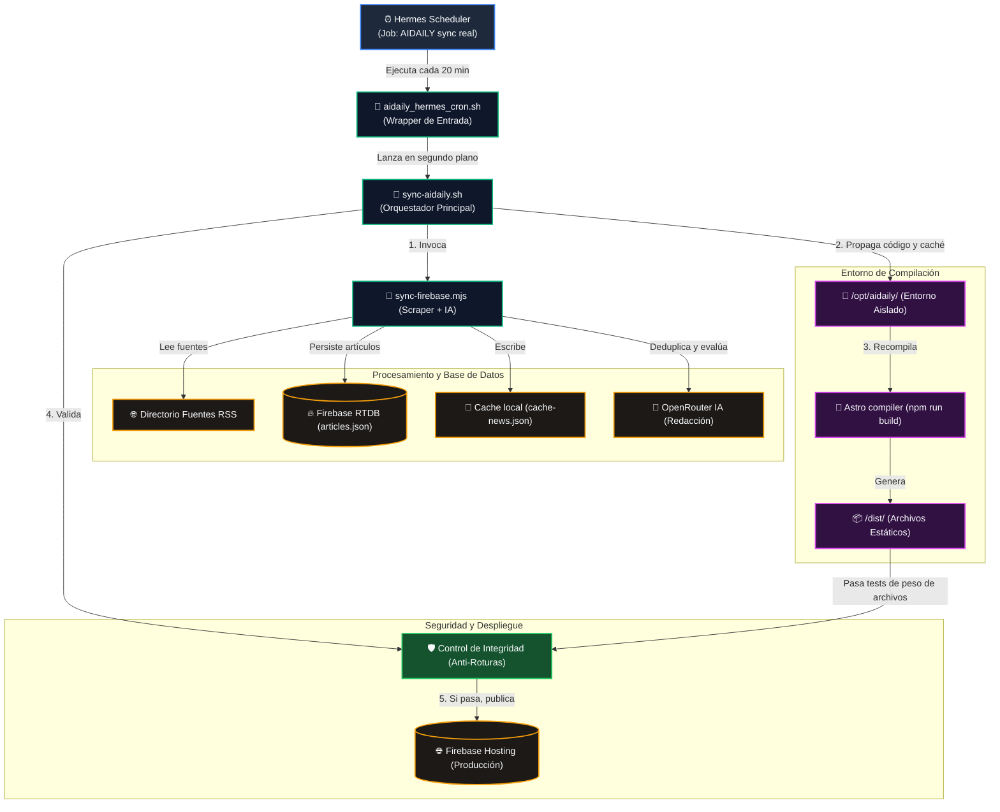
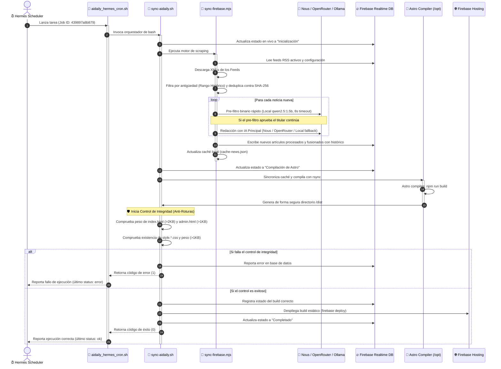

# Arquitectura de Sincronización y Motor de AIDAILY (Hermes)

Este documento detalla el funcionamiento del motor de scraping, procesamiento con Inteligencia Artificial, compilación estática y despliegue continuo de **AIDAILY** controlado de forma nativa desde el Scheduler de Hermes.

---

## 1. Mapa Mental de la Arquitectura (Flujo General)

El siguiente diagrama muestra los componentes que interactúan en la VPS y la secuencia de datos desde la captura de fuentes hasta la publicación final en Firebase Hosting.



---

## 2. Diagrama de Secuencia del Proceso

El flujo exacto que se ejecuta de forma cronometrada para garantizar actualizaciones rápidas, deduplicación e integridad visual:



---

## 3. Desglose de Fases y Mecanismos de Seguridad

### A. Control de Ejecución y Concurrencia (Hermes Scheduler + Wrapper)
Para evitar que ejecuciones lentas de la IA se acumulen, consuman recursos descontroladamente o agoten las APIs, el pipeline se ejecuta mediante el planificador interno **Hermes Scheduler** (job `439897a8b879` `AIDAILY sync real 📰`) cada 20 minutos en el perfil principal. Este planificador ejecuta el script wrapper `/home/ubuntu/.hermes/scripts/aidaily_hermes_cron.sh`, el cual redirige las salidas de logs y gestiona el código de retorno. Adicionalmente, el script principal `sync-aidaily.sh` mantiene el uso interno de `flock -n /var/tmp/aidaily-sync.lock` y el sistema de autocuración automática (antigüedad > 12 min) para evitar deadlocks.

### B. El Mecanismo Anti-Roturas (Control de Integridad)
Es una de las partes críticas implementadas en el script `sync-hourly.sh`. Dado que la web usa Astro y compila componentes estáticos al vuelo usando datos de Firebase y estilos CSS de vanilla, cualquier cambio inesperado en los feeds o un error de parseo podría generar una página en blanco. 
Para mitigar esto, antes del despliegue se comprueba:
1. **Existencia física y tamaño mínimo** de los archivos estructurantes (`index.html` y `admin.html`).
2. **Presencia de selectores CSS específicos** en el stylesheet compilado de Tailwind/Vanilla (`.portal-news-grid` y `.news-card`). Si por algún motivo el compilador omite estas clases de estilo, el script cancela el despliegue a producción y conserva la versión funcional previa.

### C. Aislamiento del Entorno (`/opt/aidaily`)
La compilación final no se hace en el espacio de trabajo activo de la VPS (donde se editan los archivos y se hacen las pruebas) para evitar mezclar compilaciones temporales. En su lugar, el script clona la configuración y utiliza `rsync` hacia `/opt/aidaily/` donde ejecuta la compilación de forma completamente aislada.

---

## 4. Router Multi-Proveedor de IA

El sistema implementa un router de 3 niveles que alterna entre proveedores de IA de forma automática. Ver documentación detallada en [model_routing_workflow.md](file:///c:/Users/yo/Pictures/Descargaspc/0a/hermes/AIDAILY/docs/architecture/model_routing_workflow.md).

| Nivel | Proveedor | Modelo Preferido | Timeout |
|-------|-----------|------------------|---------|
| 1 | **OpenRouter Free** | `openai/gpt-oss-20b:free` | 20s |
| 2 | **Nous Research** | `stepfun/step-3.7-flash:free` | 120s |
| 3 | **Ollama Local** | Pool: `llama3.2`, `gemma2` | 45s |
| Pre-filtro | **Ollama Local** | `llama3.2` (binario YES/NO) | 8s |

### Variables de Entorno Actuales

```bash
OLLAMA_TEXT_MODELS=llama3.2,gemma2
OLLAMA_TEXT_MODEL=gemma2
OLLAMA_FILTER_MODEL=llama3.2
OLLAMA_TEXT_MAX_TOKENS=2000
OLLAMA_TEXT_CONTEXT_CHARS=4000
```
