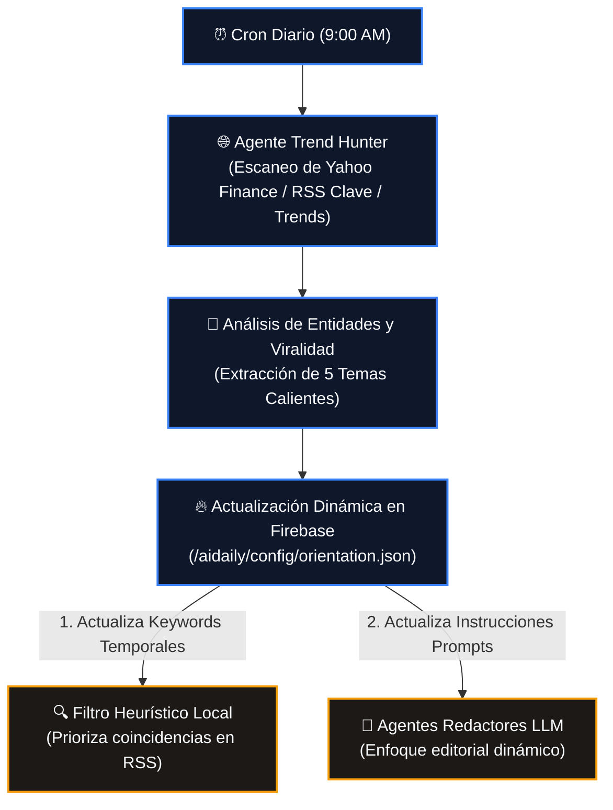

# Agente de Tendencias Dinámicas y SEO (AIDAILY Trend Hunter)

Este documento detalla la propuesta técnica para implementar un **Agente de Tendencias Autónomo** que corre cada mañana a las 9:00 AM para adaptar la línea editorial del portal en tiempo real según el interés del público y optimizar el posicionamiento SEO.

---

## 1. Concepto y Flujo de Trabajo

El objetivo es automatizar la orientación del contenido sin intervención humana. En lugar de tener una lista estática de palabras clave y filtros de relevancia, un agente especializado analiza las búsquedas e intereses reales de internet al inicio del día y ajusta los parámetros del motor de scraping.

---

## 2. Componentes del Agente de Tendencias

### A. Escaneo de Señales de Interés (9:00 AM)
El script recopilará titulares y volumen de interés usando tres canales de bajo consumo y alta fidelidad:
1. **Yahoo Finance RSS (Markets/Tech)**: Para capturar fusiones, caídas de bolsa, lanzamientos de productos de Nvidia/OpenAI/Apple/Google, etc.
2. **Feeds RSS de Noticias de Última Hora (Reuters/El País/NYT)**: Para capturar incidentes geopolíticos o catástrofes mundiales de impacto masivo.
3. **Google Trends RSS (España/Global)**: Para identificar los temas con mayor crecimiento de búsquedas de la mañana.

### B. Extracción de Temas del Día (Prompt de Entidades)
El agente toma los 50 titulares de mayor tracción recogidos y realiza una llamada rápida a la IA para extraer:
* **Entidades clave**: Empresas (ej. *Nvidia*), personajes (ej. *Puigdemont*), tecnologías (ej. *Claude 3.5*), o ubicaciones (ej. *Francia*).
* **Temas en auge**: Los 3 o 4 sucesos del día con mayor relevancia informativa.

### C. Actualización en Caliente de la Configuración en Firebase
El agente reescribe dinámicamente los siguientes nodos en Firebase RTDB:
* `/aidaily/config/orientation/activeKeywords`: Un listado temporal de palabras clave que suman +3.0 puntos en la heurística local (ej: si hoy se habla del "terremoto de Japón", esa frase sumará puntuación para saltarse cualquier descarte y ser evaluada con prioridad).
* `/aidaily/config/orientation/instructions`: Se añade un apéndice dinámico al prompt de redacción de la IA:
  > *"Contexto de Tendencias de Hoy: Hay gran interés público en [Tema]. Si la noticia se relaciona con esto, destaca en el 'Por Qué Importa' sus implicaciones en este suceso."*

---

## 3. Ventajas Estratégicas y SEO

1. **Viralidad y Tráfico Orgánico**: Al publicar resúmenes de IA estructurados sobre temas de búsqueda del mismo día con pocas horas de diferencia, el portal se posicionará de forma prioritaria en Google Discover y búsquedas orgánicas.
2. **Relevancia del Contenido**: Se evita el problema de subir demasiadas noticias atemporales o secundarias (como gastronomía) si hay un evento de gran impacto global ocurriendo en ese instante.
3. **Ahorro de Cómputo**: Al enfocar el pre-filtro de relevancia en las tendencias activas del día, los redactores se centran en procesar solo contenido de alto interés, reduciendo costes y saturación.
