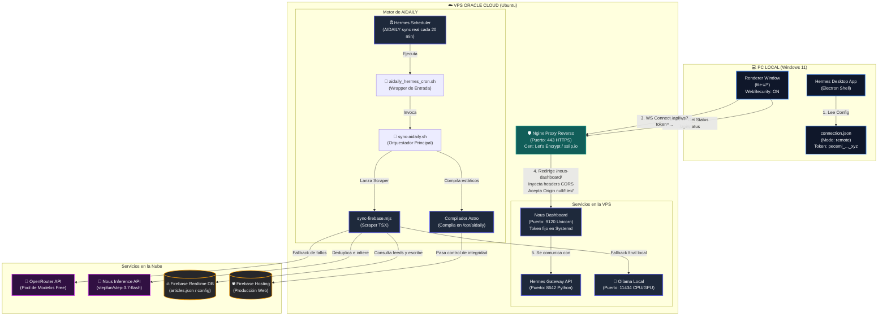
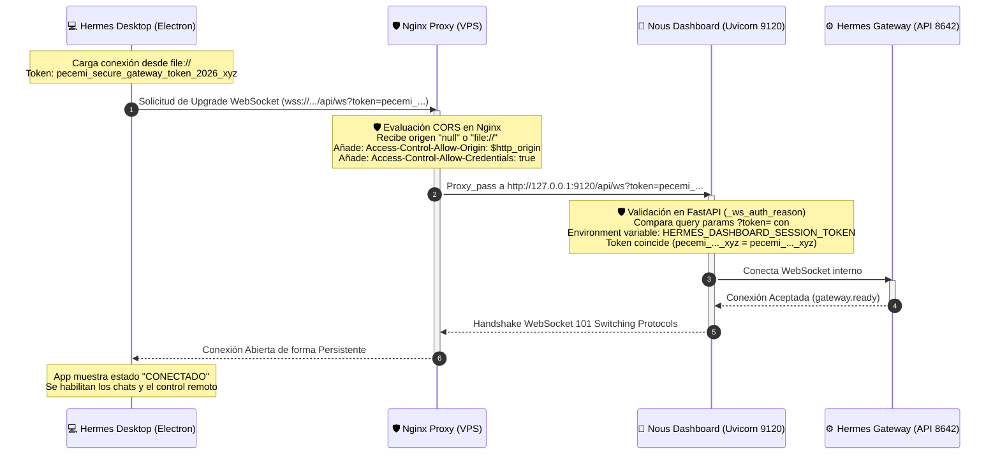
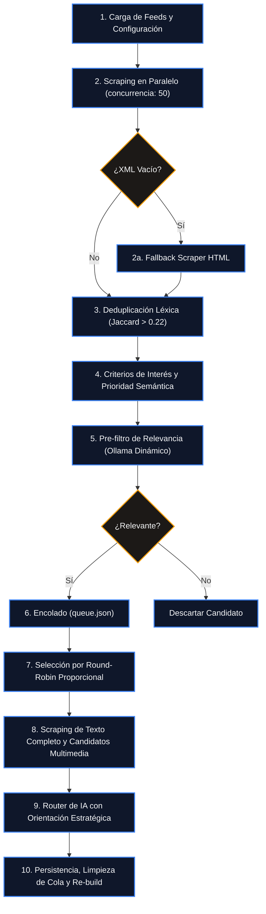
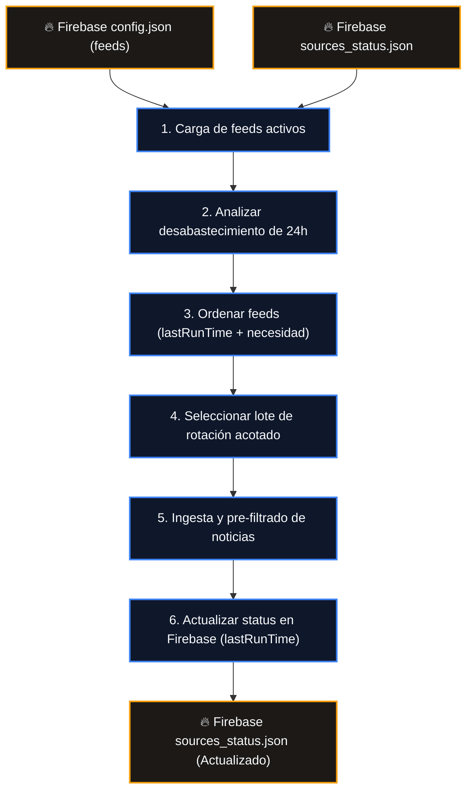

# Arquitectura Detallada de Hermes Desktop & AIDAILY (VPS)

Este documento describe con el máximo nivel de detalle técnico el ecosistema unificado que conecta tu PC local (Windows) con la VPS de Oracle Cloud, exponiendo puertos, flujos de autenticación, proxies reversos y el pipeline de sincronización continua.

---

## 1. Mapa de Infraestructura y Flujo de Red

El siguiente diagrama detalla la conexión física y los protocolos entre el PC local y la VPS, describiendo cómo se resuelven las restricciones de CORS en la app de escritorio (Electron):



---

## 2. Mapa Detallado de Puertos e Interfaces en la VPS

La VPS actúa como un concentrador de servicios. Aquí se detallan los puertos abiertos, protocolos, propósitos y su accesibilidad externa:

| Puerto Local | Protocolo | Servicio | Acceso Público a través de Nginx | Autenticación / Seguridad |
| :--- | :--- | :--- | :--- | :--- |
| **`443`** | HTTPS | Nginx Principal | **Directo** (`https://143-47-35-167.sslip.io`) | SSL Let's Encrypt. Deriva a subrutas. |
| **`9120`** | HTTP/WS | Nous Dashboard (Uvicorn) | **Sí**, vía `/nous-dashboard/` | Token estático (`HERMES_DASHBOARD_SESSION_TOKEN`). |
| **`9122`** | HTTPS | Nous Dashboard Directo | **Sí**, puerto dedicado seguro | Autenticación Básica HTTP (nginx htpasswd). |
| **`8642`** | HTTP | Hermes Gateway API | **No** (solo acceso local localhost) | API Key estática compartida en local. |
| **`11434`** | HTTP | Ollama API | **No** (solo acceso local localhost) | Ninguna (bloqueado por Firewall externo). |
| **`8787`** | HTTP | Nesquena WebUI | **Sí**, vía puerto `9119` HTTPS | Autenticación Básica HTTP (nginx htpasswd). |
| **`8000`** | HTTP | Algotrading (FastAPI) | **Sí**, vía puerto `8443` HTTPS | Autenticación Básica HTTP (nginx htpasswd). |
| **`18795`** | HTTP | FileBrowser | **Sí**, vía puerto `9121` HTTPS o `/filebrowser/` | Autenticación Básica HTTP. |
| **`6080`** | HTTP/WS | noVNC (Escritorio Remoto) | **Sí**, vía `/novnc/` | Contraseña interna de VNC. |

---

## 3. Flujo Detallado de una Conexión de WebSocket

Este diagrama secuencial detalla paso a paso cómo se valida la conexión de tu app de escritorio con la VPS, pasando las barreras de CORS y autenticación:



---

## 4. Estructura del Proceso Cron y Sistema de Autocuidado VPS (Anti-Roturas)

El proceso de sincronización en la VPS corre **CADA 20 MINUTOS** (a los minutos :00, :20 y :40 de cada hora) mediante la ejecución del orquestador bash `sync-aidaily.sh`. Para garantizar estabilidad autónoma incondicional ante cortes de red, caídas de la IA o procesos zombis, se implementa un sistema multicapa de autoprotección:

```
[⏰ Cron VPS (Cada 20 min)]
      │
      ▼
[🐚 sync-aidaily.sh] (Orquestador VPS)
      │
      ├─► [🛡️ Adquisición de Lock / Autocuración]
      │         │
      │         ├─► Intenta adquirir flock exclusivo sobre FD 9
      │         ├─► SI ESTÁ BLOQUEADO: Lee PID del lockfile (/var/tmp/aidaily-sync.lock)
      │         │     ├─► Antigüedad > 12 min ──► kill -9 PID + Borrar lockfile + Reintentar
      │         │     └─► Antigüedad <= 12 min ─► Salir (evita ejecuciones paralelas)
      │         ▼
      ├─► [🧹 Autolimpieza Preventiva]
      │         └─► Busca y mata procesos huérfanos de sync-firebase.mjs colgados
      │
      ├─► [🔄 Reintentos con Backoff Exponencial]
      │         ├─► run_with_retry: 3 intentos con pausas de 20s y 40s para:
      │         │     ├─► TSX Sync (Ingesta/Deduplicación/IA)
      │         │     ├─► Astro Build (Compilación de estáticos)
      │         │     └─► Firebase Deploy (Publicación a Hosting)
      │         ▼
      ├─► [🛡️ Control de Integridad Post-Build]
      │         ├─► Comprobar index.html > 2 KB
      │         ├─► Comprobar admin.html > 1 KB
      │         ├─► Comprobar estilos CSS > 1 KB
      │         │     ├─► FALLA ──► Reporta error a Firebase y aborta despliegue
      │         │     └─► OK ─────► Registra { "ok": true } en sources_status.json
      │         ▼
      └─► [🔔 Trap de Salida: Alertas Hermes]
                └─► Ante fallo crítico en los 3 intentos, notifica instantáneamente
                    al canal de Telegram del usuario vía Hermes Bot.
```

### A. Mecanismo de Autocuración y flock Exclusivo
1. **Adquisición del Lock**: Se asocia el FD 9 al archivo de lockfile `/var/tmp/aidaily-sync.lock` y se intenta adquirir un bloqueo no bloqueante (`flock -n 9`).
2. **Detección de Bloqueos Calientes**: Si el bloqueo falla, el script consulta la fecha de modificación del archivo física. Si su antigüedad excede los **12 minutos**, asume que la ejecución anterior quedó en estado zombi por cuelgues de red. El script lee el PID grabado dentro del lockfile, le envía un `kill -9` incondicional, borra el lockfile y arranca el ciclo de forma limpia.
3. **Autolimpieza de Node.js**: Al iniciar, busca activamente y mata cualquier proceso residual de Node.js ejecutando `sync-firebase.mjs` de ejecuciones previas estancadas.

### B. Notificaciones de Fallo y Alertas en Tiempo Real (Hermes Bot)
Si el script agota todos los reintentos y falla, el manipulador de traps de salida (`handle_exit`) intercepta el error:
1. Registra el estado de error en `/aidaily/sources_status.json` en Firebase con el detalle del fallo.
2. Invoca al bridge de Hermes en `/home/ubuntu/workspace/antigravity_db_handler.py` para insertar una alerta de tipo `assistant` en la base de datos de chat de Telegram del usuario y ejecuta `sync_all_profiles.py` para retransmitir de forma inmediata el error al móvil del usuario.

### C. Heartbeat de Inactividad y Alertas Visuales (Frontend)
El cliente público y el panel de administración monitorean el timestamp de la propiedad `updatedAt` del nodo `/aidaily/sources_status/build_status.json`:
1. **Marquesina en Web Pública**: En `index.astro`, si la diferencia de tiempo entre la hora actual del navegador y `updatedAt` excede los **40 minutos** (equivalente a la omisión de 2 ejecuciones del cron), inyecta un banner rojo premium advirtiendo de que la VPS no responde y las noticias pueden estar desactualizadas.
2. **LED de Estado de Salud en Admin**: En `DashboardPanel.jsx`, el LED de salud cambia a un pulso animado en rojo con la advertencia `SIN RESPUESTA`.
3. **Botón Directo "🔥 FORZAR AUTOCURACIÓN VPS"**: Si el usuario pulsa este botón en el panel de Admin, se envía un mensaje de restauración al bridge en la VPS que libera de inmediato los bloqueos del sistema de archivos y fuerza un ciclo completo de sincronización.

---

## 5. Flujo de Procesamiento Detallado del Motor de Scraping e IA

El ciclo de procesamiento asíncrono se optimizó para gestionar la concurrencia de red y los rate-limits de las APIs de IA:



### Paso 1: Inicialización y Lectura de Configuración
El script lee la configuración activa en `/aidaily/config.json` en Firebase, incluyendo el nodo de intereses dinámicos (`orientation/interests`) configurado por el usuario en el Admin.

### Paso 2: Scraping de Feeds RSS y Fallbacks
1. Se lanzan peticiones asíncronas en paralelo para descargar los archivos XML de las fuentes con una concurrencia controlada de **50 peticiones simultáneas** y timeout de **12 segundos**.
2. **Modulo de Fallback HTML**: Si el feed devuelve un XML vacío o corrupto, se hace scraping del HTML buscando enlaces de noticias de manera heurística.

### Paso 3: Deduplicación Inicial y Coeficiente Jaccard (Umbral > 0.22)
Compara los títulos y las URLs de los candidatos con el historial acumulado en `cache-news.json`. Si la similitud Jaccard de caracteres de un titular excede el **22%**, se descarta localmente para evitar redundancias de diferentes agencias de noticias.

### Paso 4: Criterios de Interés y Prioridad Semántica Local
El motor aplica las pautas de interés configuradas en el Admin de forma local en la función `evaluateNewsRelevanceLocal`:
* **Palabras de Bloqueo Incondicional** (ej. *farandula, cotilleo*): Si el título contiene alguna palabra prohibida, la puntuación heurística se baja a `1.0` y se descarta inmediatamente sin llamadas de IA.
* **Países Prioritarios** (ej. *España*): Suma un **bonus de +2.0 puntos** de relevancia.
* **Temas Preferentes** (ej. *Fórmula 1, Geopolítica*): Suma un **bonus de +2.0 puntos**.
* **Entidades/Deportistas Clave** (ej. *Carlos Alcaraz, Fernando Alonso*): Suma un **bonus de +3.0 puntos** de relevancia para forzar la aprobación del artículo.

### Paso 5: Pre-filtro de Relevancia Semántica (Ollama Dinámico)
Si el artículo no se aprueba de forma directa y requiere filtrado de IA, se consulta a Ollama local (`qwen2.5:1.5b` o `llama3.2:3b`). El prompt inyecta de forma dinámica los países, temas y personajes prioritarios del usuario para que Ollama evalúe la relevancia binaria (YES/NO) de forma precisa e inteligente.

### Paso 6: Encolado de Artículos Candidatos
Aquellos artículos aprobados por el pre-filtro de relevancia se suben a la cola en Firebase RTDB (`/aidaily/queue.json`).

### Paso 7: Selección por Round-Robin Proporcional
Para evitar el estrangulamiento de noticias debido a límites fijos de categoría o fuente, se calculan límites dinámicos proporcionales basados en el tamaño de lote configurado (`maxExecutionBatch`):
* **Cap de categoría dinámico**: `maxArticlesPerCategory = Math.max(15, Math.ceil(maxExecutionBatch / numActiveCats))`
* **Cap de fuente dinámico**: `maxArticlesPerSource = Math.max(8, Math.ceil(maxExecutionBatch / 8))`
* El algoritmo recorre de forma rotativa las categorías activas y extrae el lote balanceado (hasta 100 artículos) sin desechar noticias válidas.

### Paso 8: Scraping Completo y Candidatos Multimedia
Para cada artículo del lote, se descarga su texto limpio en paralelo (concurrencia de 10) y se extraen los candidatos multimedia (imágenes, vídeos de youtube, tweets).

### Paso 9: Inferencia de IA con Orientación Estratégica (Router de 3 Niveles)
Se invoca la redacción en español usando Nous API (`stepfun/step-3.7-flash:free`), OpenRouter, o Ollama local. El prompt inyecta los criterios de interés y prioridad semántica bajo la directiva `ORIENTACIÓN DE CONTENIDO Y ENFOQUE ESTRATÉGICO`, forzando a la IA a redactar el artículo, puntos clave y el "whyMatters" enfocados directamente en las implicaciones geográficas o personajes clave elegidos por el usuario.

### Paso 10: Persistencia, Limpieza de Cola y Re-build
El artículo es subido a Firebase, eliminado de la cola, y se compilan las páginas estáticas del portal Astro mediante `sync-aidaily.sh`.

---

## 6. Gestión, Rotación y Priorización de las Fuentes de Noticias (+500 Feeds)

Para procesar más de 500 feeds RSS/HTML sin bloquear la VPS, saturar el ancho de banda ni agotar los límites de cuota de las APIs de IA, el sistema implementa un sistema inteligente de rotación y priorización de fuentes:



### A. Carga Dinámica e Identificación de Fuentes
* El motor lee las fuentes del nodo `feeds` en Firebase (originalmente importadas desde `directorio_fuentes.xlsx`).
* A cada feed se le calcula un `hashId` de 16 caracteres mediante el hash SHA-256 de su URL única:
  $$\text{hashId} = \text{SHA-256}(\text{feedUrl})[0..16]$$
* Este ID actúa como clave en `sources_status.json` para persistir el historial de ejecuciones y conteos de forma independiente del nombre del feed.

### B. Análisis de Desabastecimiento (Demanda de Noticias)
Antes de comenzar la rotación, el motor lee el historial del último día en Firebase e identifica las categorías y subcategorías que tienen menos de 30 noticias publicadas en las últimas 24 horas.
* **Categorías Desabastecidas**: Priorizan de forma inmediata el rastreo de sus feeds asociados en la cola de procesamiento.
* **Subcategorías Vacías (0 noticias)**: Tienen máxima prioridad. El motor alterará la rotación estándar para forzar el escaneo de estos feeds específicos e intentar abastecerlas.

### C. Algoritmo de Rotación Equitativa
Para garantizar que todos los feeds se procesen de forma periódica, el motor de scraping calcula un índice de prioridad dinámico para ordenar y seleccionar el lote de feeds a procesar en el ciclo actual de 20 minutos:
1. **lastRunTime**: Los feeds que llevan más tiempo sin procesarse (o que nunca se han procesado) se colocan al principio de la lista.
2. **Conteo histórico (`articlesScrapedCount`)**: Se prefiere rotar feeds que tengan aportaciones históricas consistentes.
3. **Selección del Lote**: Se escanea una fracción acotada (por ejemplo, entre 30 y 60 feeds prioritarios) en cada ciclo del cron.
4. **Persistencia de Estado**: Al finalizar la ingesta, se actualiza el objeto `runStatusUpdates` subiendo a Firebase los nuevos valores de `lastRunTime` y la cantidad de artículos extraídos. Esto manda el feed al final de la cola de rotación para los siguientes ciclos, permitiendo que otras fuentes tomen su lugar de forma 100% equitativa y autónoma.


