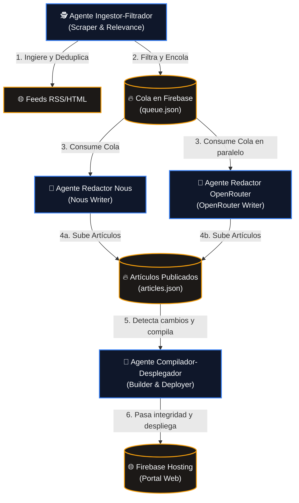
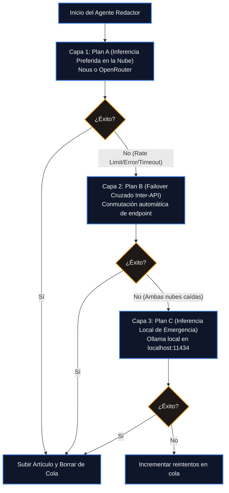

# Arquitectura Unificada Multi-Agente de Hermes (AIDAILY)

Este documento detalla la propuesta de transición del pipeline actual monolítico hacia un **ecosistema de micro-agentes independientes y desacoplados** en Hermes. El objetivo es maximizar la robustez del sistema, evitar cuelgues en cascada y permitir que cada modelo de IA funcione como un agente autónomo y dedicado.

---

## 1. Diseño del Flujo de Micro-Agentes Desacoplados

En lugar de que un único script en Node.js realice la ingesta, evaluación, pre-filtrado, redacción con router y build estático de Astro de forma lineal, la arquitectura se divide en 4 agentes autónomos que se comunican de forma asíncrona a través de Firebase RTDB (cola e historial):

---

## 2. Definición y Responsabilidades de los Agentes

### Agente 1: Ingestor-Filtrador (Scraper & Relevance)
* **Propósito**: Capturar, normalizar y evaluar rápidamente las noticias del día.
* **Flujo**:
  1. Descarga en paralelo los +500 feeds RSS/HTML.
  2. Filtra la antigüedad y deduplica léxicamente usando el coeficiente Jaccard (`> 0.23`) contra el historial.
  3. Realiza la evaluación de relevancia binaria (YES/NO) usando Ollama local (`llama3.2`) con timeout estricto de 8s.
  4. Encola las noticias aprobadas en `/aidaily/queue.json` en Firebase con una prioridad calculada por desabastecimiento.
* **Frecuencia**: Corre cada 20 minutos de forma autónoma.

### Agente 2: Redactor Nous (Nous Writer)
* **Propósito**: Consumir la cola de Firebase y redactar noticias usando la API de Nous.
* **Flujo**:
  1. Lee y selecciona noticias prioritarias de la cola en Firebase.
  2. Hace scraping del contenido completo y multimedia.
  3. Redacta el artículo estructurado en español usando `step-3.7-flash:free` en la Nous API.
  4. Sube el artículo a `/aidaily/articles/{id}.json` y borra el elemento de la cola.
* **Aislamiento**: Si la API de Nous falla o tiene rate limits, el agente se detiene de forma aislada sin afectar al resto del sistema.

### Agente 3: Redactor OpenRouter (OpenRouter Writer)
* **Propósito**: Consumir la cola de Firebase en paralelo y redactar usando modelos gratuitos de OpenRouter.
* **Flujo**:
  1. Lee y selecciona noticias de la cola.
  2. Redacta el artículo en español usando `gpt-oss-20b:free` en OpenRouter.
  3. Sube el artículo redactado a Firebase y lo elimina de la cola.
* **Aislamiento**: Trabaja de forma complementaria al Agente Nous, actuando como un balanceador de carga natural de la cola.

### Agente 4: Compilador-Desplegador (Builder & Deployer)
* **Propósito**: Recompilar el portal web en Astro de forma reactiva y actualizar el Hosting.
* **Flujo**:
  1. Escucha cambios en `/aidaily/articles.json` en Firebase.
  2. Cuando detecta inserciones nuevas, sincroniza la caché local `cache-news.json` en `/opt/aidaily/`.
  3. Ejecuta `npm run build` en Astro en el entorno aislado.
  4. Pasa el control de integridad visual anti-roturas.
  5. Si la validación es correcta, lanza `firebase deploy` para actualizar el portal público.

---

## 3. Planes de Fallback y Resiliencia Cruzada (Inferencia Inmune a Fallos)

Aunque la arquitectura orientada a agentes aísla los procesos de red de cada agente, los propios redactores individuales implementan un **esquema de failover de 3 capas** y auto-recuperación para garantizar que nunca fallen al procesar un artículo de la cola:

### Capa 1: Plan A (Endpoint Preferente de la Nube)
* Cada agente realiza su petición HTTP al endpoint preferente asignado (Nous API para el Agente Nous, u OpenRouter para el Agente OpenRouter).
* Utiliza cabeceras de `User-Agent` de navegador reales y timeouts máximos adaptados (120s para Nous, 75s para OpenRouter) para esperar la inferencia compleja de redacción.

### Capa 2: Plan B (Failover Cruzado Automático Inter-API)
Si el endpoint preferente devuelve un código de estado erróneo (como HTTP `429 Too Many Requests`, `502 Bad Gateway`, o excede el timeout de la petición):
* El agente **conmuta sus credenciales y endpoint dinámicamente**:
  * Si es el Agente Nous: Redirige de inmediato la petición a la API de **OpenRouter** para procesar ese artículo específico.
  * Si es el Agente OpenRouter: Redirige la petición a la **Nous API**.
* Esto se denomina **Failover Cruzado Inter-Agente** y aprovecha la redundancia de las APIs de nube de forma cruzada.

### Capa 3: Plan C (Inferencia Local de Emergencia - Air-Gapped Fallback)
En caso de fallo total de conectividad a internet en la VPS o caída simultánea de Nous y OpenRouter:
* El agente desvía la petición a la instancia de **Ollama Local** que corre en `localhost:11434` en la propia VPS (`gemma2` o `llama3.2` local).
* Aunque la inferencia en la CPU local es más lenta, esto garantiza que la cola siga avanzando y publicando noticias sin depender de APIs externas.

---

## 4. Mecanismo de Autocuración de la Cola (Anti-Atascos)

Para evitar que artículos corruptos, caídas del sistema o crashes inesperados del proceso detengan el pipeline de forma permanente, los agentes implementan dos salvaguardas a nivel de cola en Firebase:

1. **Incremento Preventivo de Intentos (`attempts`)**:
   * Antes de transferir los datos del artículo al LLM, el agente que lo ha reclamado incrementa de forma atómica en Firebase el contador de intentos del elemento (`attempts = attempts + 1`).
   * Si ocurre un crash letal durante la inferencia o redacción, el artículo no causará un bucle infinito en el siguiente ciclo.
   * **Umbral de Descarte**: Al alcanzar **3 intentos fallidos**, el artículo se elimina definitivamente de la cola y se escribe una alerta en `sources_status.json` para su posterior inspección por el administrador.

2. **Bloqueo Temporal de Visibilidad (Visibility Timeout)**:
   * Al seleccionar un artículo de la cola, el agente lo marca en Firebase con las propiedades `lockedBy` (identificador del agente) y `lockedAt` (marca de tiempo actual).
   * Los demás agentes en paralelo ignoran este artículo mientras esté bloqueado.
   * **Liberación por Inactividad**: Si transcurren más de 5 minutos y el artículo no ha sido borrado de la cola (lo que indica que el agente que lo procesaba sufrió un cuelgue o caída), los otros agentes consideran el bloqueo como expirado, limpian las marcas y vuelven a dejar el artículo disponible para procesamiento.

---

## 5. Ventajas del Nuevo Diseño

1. **Robustez Inquebrantable**: El pipeline es tolerante a fallos de red externos, rate limits, interrupciones de internet y caídas de servidores gracias a las capas de contingencia redundantes y la inferencia local de emergencia.
2. **Aislamiento de Fallos Total**: Los cuelgues o timeouts de red de una API quedan completamente contenidos en su agente redactor respectivo. La ingesta de noticias y la compilación de la web nunca se detienen.
3. **Descongestión de CPU y Recursos**: La separación en micro-servicios y el procesamiento de la cola basado en bloqueos asíncronos reduce los picos de consumo de CPU en la VPS, haciendo que la ejecución sea fluida y constante.

